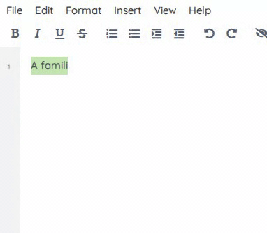

 [](https://github.com/ether/ep_file_menu_toolbar/actions/workflows/test-and-release.yml)

# A simple to use and responsive File menu / toolbar


## Installation
Install using /admin/plugins 
OR
``git clone git@github.com:ether/ep_file_menu_toolbar.git``

## Adding your plugin to the menus

Every menu is an [eejs block](https://etherpad.org/doc/latest/#index_eejsblock_name),
so a plugin puts itself in the file menu by rendering a template into the
block it belongs in — no change is needed in `ep_file_menu_toolbar`:

| Block | Menu | Use it for |
| --- | --- | --- |
| `dd_file` | File | pad-level actions |
| `dd_edit` | Edit | undo/redo style actions |
| `dd_format_text` | Format, first group | formatting applied to a **selection** (subscript, superscript, ...) |
| `dd_format_block` | Format, second group | formatting applied to whole **lines** (headings, alignment, ...) |
| `dd_format` | Format, third group | anything else in Format (font pickers, clear formatting, ...) |
| `dd_insert` | Insert | inserting content |
| `dd_view` | View | display toggles |
| `dd_help` | Help | links and about entries |

```js
// index.js
const {template} = require('ep_plugin_helpers');
exports.eejsBlock_dd_format_block = template('ep_myplugin/templates/fileMenu.ejs');
```

```json
// ep.json
{"parts": [{"name": "main", "hooks": {
  "eejsBlock_dd_format_block": "ep_myplugin/index"
}}]}
```

The menu entry is plain HTML. Reuse the handler your editbar button already
has (most plugins bind by class, e.g. `$('body').on('click', '.ep_myplugin', ...)`)
and localize the label with `data-l10n-id`:

```html
<li><a href="#" class="ep_myplugin" data-l10n-id="ep_myplugin.title">My thing</a></li>
```

## TODO
* i18n support
* Test against weird wrap/pad scrolling edge cases
* Clean refactor <-- see .ejs file!


